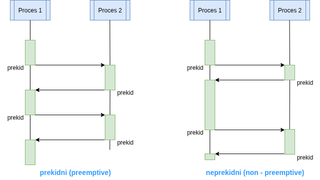
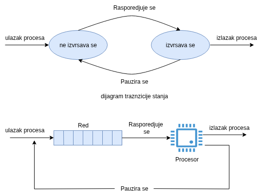
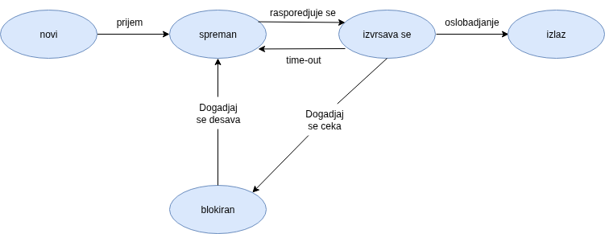
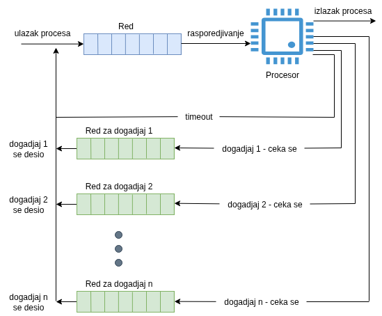

Proces mozemo da definisemo kao:
- Proces je program u izvrsavanju.
- Proces je primerak programa koji se izvrsava u racunaru.
- Proces je entitet koji se moze dodeliti procesoru i u njemu izvrsavati.
- Proces je jedinica aktivnosti koju karakterise izvrsavanje niza instrukcija, tekuce stanje i dodeljeni set sistemskih resursa.
## Struktura upravljackog bloka procesa
Pored koda i skupa podataka, proces poseduje i upravljacki blok
```
-------------------
| Identifier      |
-------------------
| State           |
-------------------
| Priority        |
-------------------
| Program Counter |
-------------------
| Memory Pointers |
-------------------
| Context Data    |
-------------------
| I/O Status Info |
-------------------
| Accounting Info |
-------------------
| . . .           |
-------------------
```
## Stanje procesa

> [!NOTE] Trag (Trace) procesa
> Ponasanje procesa moze se predstaviti **sekvencom instrukcija** koji se izvrsavaju za taj konkretan proces

> [!NOTE] Dispecer (Dispatcher)
> **Dispecer** je relativno mali program koji je deo OS-a i ciji je zadatak da prebacuje procesor sa programa na program. Dispecer moze biti **neprekidni (non - preemptive)** i **prekidni (preemptive)**


### Jednostavan primer stanja procesa

### Model procesa sa dva stanja

Proces A: |                |-----------------------------------------|              |-------------------------|
Proces B: |--------------------|         |xxxxxxxxxxxxxxxxxxxxxxxxxxxxxxxxxxxxxxx|
Proces C: |-----------------------------------|                |--------------------------|                    |
Rasporedjivac:          |      |          |    |                 |     |                |      |

|   |: izvrsava se, | -- |: spreman za ivrsavanje, |xx|: blokiran
### Kreiranje procesa
Razlozi za kreiranje procesa:
1. **Novi paketni (batch) posao** - OS-u se podnosi zahtev za novi za novi paketni posao
2. **Interaktivni login** - otvara se seija za korisnika
3. **Kreira se od strane OS-a da bi obezbedio uslugu** - recimo print server
4. **Kreira se od strane postojeceg procesa** - *spawn*

> [!parent-child] Roditelj - dete procesi
> Kada jedan proces kreira drugi, stvar se odnos roditelj - potomak (parent - child) izmedju njih. Uobicajeno je da oni komuniciraju.
### Terminacija procesa
Razlozi za terminaciju procesa:
1. Normalna terminacija
2. Prekoracenje vremenskog limita (*CPU time* ili *Wall Clock time*)
3. Nedostupnost memorije
4. Krsenje granica memorije
5. Greska zastite
6. Aritmeticka greska
7. Prekoracenje vremena (proces cekao predugo na neki resurs)
8. Otkaz U/I
9. Pogresna instrukcija
10. Privilegovana instrukcija (proces pokusao da koristi kernel mode instrukciju)
11. Pogresna upotreba podataka
12. Intervencija operatora ili OS-a
13. Terminacija procesa roditelja
14. Zahtev procesa roditelja
### Model procesa sa pet stanja
Pretpostavka:  Koristi se *Round-robin* tehnika kruznog dodeljivanja

**Problem**: Ako postoji samo jedan red cekanja za sve procese, dispecer bi svaki put morao da skenira taj red kako bi utvrdio koji proces nije blokiran i koji je u redu bio najduze.
**Resenje**: Stanje ne izvrsava se podeliti na dva stanja -> spreman i blokiran. 

Znacenje pojedinacnih stanja:
1. **Izvrsava se** - Proces koji se trenutno izvrsava
2. **Spreman** - Proces koji je spreman za izvrsavanje kada dobije procesor na koriscenje
3. **Blokiran** - Proces koji ne moze da nastavi sa izvrsavanjem dok se ne pojavi neki dogadja, npr. kraj U/I operacije
4. **Novi** - Proces koji je upravo kreiran, ali ga OS jos nije stavio na red spremnih. Obicno su to procesi kojima je napravljen upravljacki blok, ali jos uvek nisu ucitani u memoriju.
5. **Izlaz** - Proces koji je na normalan nacin prekinuo sa radom ili ga je OS skinuo sa reda iz nekog drugog razloga

Ukoliko imamo samo jedan red za cekanje za procese koji su u stanju blokiran, u trenutku kada se pojavi bilo koji dogadjaj (recimo U/I) dispecer mora da skenira ceo red kako bi utvrdio koji od blokiranih procesa ceka bas taj dogadjaj.
Resenje ovog problema -> uvesti vise redova blokiranih procesa za svaki tip dogadjaja posebno.

### Suspendovani procesi
**Problem**: Ukoliko vise procesa mora da ceka spori U/I, procesor u sistemu bez virtuelne memorije i dalje moze veci deo vremena da provede besposlen.
**Resenje**: Ako nijedan proces u RAM-u nije u stanju Spreman, OS prebacuje jedan proces na disk u red Suspendovanih procesa. Tada OS moze da preuzme u RAM drugi proces iz reda suspendovanih ili prima zahtev za novim procesom.

### Model sa dva suspendovana stanja
Stanja procesa:
1. **Spreman** - Proces je u RAM - u i raspoloziv za izvrsavanje
2. **Blokiran** - Proces je u RAM - u i ceka na dogadjaj
3. **Blokiran / Suspendovan** - Proces je na disku i ceka na dogadjaj
4. **Spreman / Suspendovan** - Proces je na disku ali ce biti raspoloziv za izvrsavanje cim dodje u RAM
### Ostali razlozi za suspenziju procesa
**Suspenzija procesa** se kao pojam moze generalizovati i nastaje usled jednog od razloga navedenih:
1. **Razmenjivanje**  - *Swapping, Paging*
2. **Drugi razlozi OS** - recimo suspenzija procesa za koji se sumnja da je malicioznog karaktera
3. **Interaktivni zahtev korisnika** - na Linux `kill -STOP 945` `kill -CONT 945`
4. **Vremenska sinhronizacija** - Periodicna suspenzija / nastavak rada
5. **Zahtev procesa roditelja**

> [!NOTE] Uloga operativnog sistema
> Operativni sistem mozemo posmatrati kao entitet koji upravlja upotrebom sistemskih resursa od strane procesa.
> Operativni sistem mora da odrzava informacije o svim resursima kojima upravlja. Za ovu svrhu se koriste **tabele operativnog sistema**. 

> [!NOTE] Informacije za upravljanje procesom
> - **Rasporedjvanje i informacije o stanju**
>   - Stanje procesa (*Ready, Blocked, ...*)
>   - Prioritet
>   - Informacije vezane za rasporedjivanje (npr broj do sada izvedenih instrukcija)
>   - Dogadjaj
> - **Strukturiranje podataka** - npr pointerska veza sa sledecim procesom u listi
> - **Medjuprocesna komunikacija** - markeri, signali i poruke
> - **Privilegije procesa**
> - **Upravljanje memorijom** - pokazivaci na delove tabele stranica virtuelne memorije
> - **Vlasnistvo nad resursima i iskoriscenje** - npr. otvoreni fajlov
### Kreiranje procesa
1. Novom procesu dodeljuje se **jedinstveni identifikator**
2. Procesu se dodeljuje prostor - za elemente slike procesa
3. Inicijalizuje se PCB - ulgavnom nule, osim PC koji se setuje na pocetnu adresu tekst segmenta
4. Postavljaju se **odgovorarajuce veze** npr. veze u redu *Ready*
5. **Kreiranje ili prosirivanje ostalih struktura** - npr. obracunske informacije
### Komutiranje procesa

| Mehanizam          | Uzrok                                   | Upotreba                               |
| ------------------ | --------------------------------------- | -------------------------------------- |
| Prekid (Interrupt) | Eksterni u odnosu na tekucu instrukciju | Reakcija na asinhroni spoljni dogadjaj |
| Zamka (Trap)       | Pridruzen izvrsenju tekuce instrukcije  | Rukovanje greskom ili izuzetkom        |
| Poziv supervizora  | Eksplicitni zahtev                      | Poziv funkcije operativnog sistema     |
### Komutiranje moda vs. promena stanja procesa
**Komutiranje moda**
1. PC registar se setuje na pocetnu adresu rukovaoca prekidom (interrupt handler)
2. Procesor se prebacuje iz korisnickog moda u kernel mod, posto rutina za obradu prekida moze sadrzati privilegovane instrukcije

**Promena stanja procesa**
1. Sacuvati kontekst proceora, PC, PSW i druge registre
2. Azurirati PCB procesa koji je trenutno u *Running* stanju.
3. Pomeranje PCB-a u odgovarajuci red (*Ready, Blocked on Event* i, ...)
4. Odabir nekog drugog procesa za izvrsavanje
5. Azuriranje PCB-a odabranog procesa
6. Azuriranje memorijskih struktura
7. Ucitati stanje procesora koje je bilo aktuelno kada je poslednji put radio
